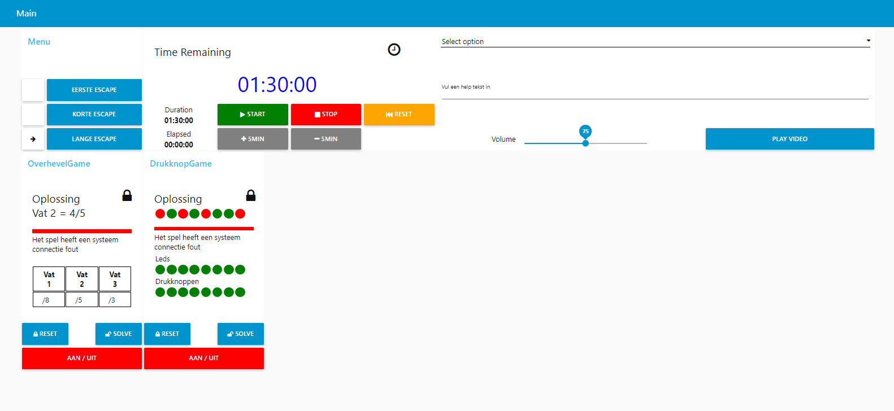

# raspberry-pi-escape-room-controller
## Beschrijving
Voor de escape room controller maken we gebruik van raspberry pi als hoofd computer.
Op de raspberry pi werd als extra node red en een mqtt broker geinstalleerd.
  - Op de raspberry pi is een scherm aangesloten die in de spelersruimte staat.
  - Via een pc maken we verbinding met de raspberry pi en node red om de escaperoom console op te starten.

De escape room console heeft een algemene sturing.
  - Er kunnen verschillende escape rooms gecontroleerd worden, met verschillende speeltijden en verschillende spelletjes.
  - Start/stop en reset van de totale speeltijd van de volledige escape room.
  - Er kan extra speeltijd gegeven worden of straftijd afgetrokken worden in stappen van 5 minuten.
  - Op het scherm in de speelruimte wordt de nog te spelen tijd constant weergeven.
  - Vanuit de controle ruimte kunnen er hints gegeven worden aan de spelers die dan verschijnt op het spelers scherm.
  - De hint verschijnt ongeveer 15 sec, waarna die dan terug verwijnt. De hint wordt ook voorgelezen door text to speech.
  - De hints kunnen voorgeschreven hints zijn die te selecteren zijn uit een tabel of die kunnen adhoc ingegeven worden.

Ieder escape spel is uitgerust met een afzonderlijke ESP8266 die geprogrameerd wordt via Arduino IDE.
Alle draadloze communicatie tussen de esp8266 en de raspberry pi wordt doorgegeven via mqtt.
Het escape spel is volledig bestuurbaar en opvolgbaar via de escape room console.
  - Aan/uit schakelen van het spel.
  - Controle van de draadloze verbinding en doorgeven van de toestand waarin het spel zich bevind.
  - Iedere verandering van het spel kan gevolgd worden op afstand op de escape room console.
  - Als het spel is opgelost gaat het spelslot open en wordt ook getoond door een open slot op scherm.
  - Kan de speler het spel niet oplossen, is er een toets op de console om het spel in "Auto solve" te plaatsen en het spel lost zichzelf op. Dit door alle stappen te doorlopen die nog nodig zijn om het spel op te lossen. Dit in vertraagde snelheid.
  - Reset van het spel.
  

## Bronnen
Youtube voorbeelden/help node red. 
Arduino. 
w3school

## Hardware
raspberry pi.  
esp8266 en esp32

## Software
node red en Mosquitto mqtt broker op raspberry pi. 
Arduino IDE. 

### Eigen scripts en programma's
C-programmeer taal. 
Html. 
Javascript. 
Voorbeeld => time format on screen

// msg.timeRemaining is in milliseconds
if (msg.timeRemaining < 0) {       // is de tijd voorbij?
    msg.timeRemaining = 0;
}

var t = msg.timeRemaining / 1000;
var h = Math.floor(t / 3600);
var m = Math.floor(t % 3600 / 60);
var s = Math.floor(t % 3600 % 60);

// Format into hh:mm:ss
msg.timerText = ("0" + h).slice(-2) + ":" + ("0" + m).slice(-2) + ":" + ("0" + s).slice(-2);

// Update the editor node
node.status({fill:"green", shape:"dot", text:msg.timerText});

// Forward the message along the flow
return msg;

 

## Escape room Console

## Scherm in de speelruimte

## Een Node-red flow voor het scherm in de speelruimte

